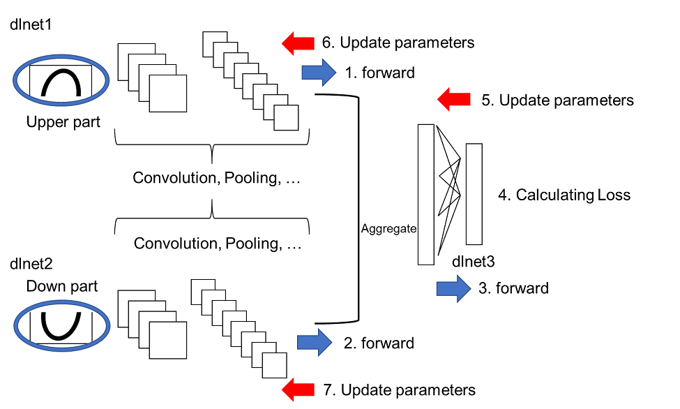

# Image Classification using Convolutional Neural Network with Multi-Input 

**[English]**  
This demo shows how to implement convolutional neural network (CNN) for image classification with multi-input using `custom loop` method. As an example, a dataset of hand-written digits called MNIST was divided into the upper half and down half as shown below and the upper and down part were fed into the multi input CNN.   
**[Japanese]**  
２種類の画像を入力できる畳み込みニューラルネットワークのデモです。２つの入力層があって、例えば、入力層Aには、動物の顔の画像を入力し、入力層Bには、その動物の足の画像を入力する、などです。2019bバージョンからカスタムループと呼ばれる方法が可能になり、深層学習のより詳細なカスタマイズが可能となりました。簡単にためせるように、手書き数字の上半分と下半分をそれぞれ別の入力層からインプットし、畳み込みなどを行った後に得られた特徴量を結合させ、さらに全結合層などで計算を進めています。よりこの例に適切なデータや課題などがございましたら教えていただけると幸いです。まだまだ作りこみ不足なところもあり、今後も更新していければよいと考えています。  





The figure above shows the classification accuracy with the multi-input CNN. The top and down part of the digits were fed into the multi-input CNN, the accuracy was over 96 %. If only the top or down part were used for the CNN, the accuracy was significantly lower than that with multi-input. 

  


Note that this figure is cited from ref [1]. The paper was talking about video classification, not still image classification. However, the fusion model described above is very infomative. In my understanding, this demo is similar to early late fusion, (but please do confirm). Other types of fusion may be implemented in my future work. In ref [2], they proposed a deep learning model called TM-CNN for multi-lane traffic speed prediction, which would be related to this demo. 

[1] Karpathy, A., Toderici, G., Shetty, S., Leung, T., Sukthankar, R., \& Fei-Fei, L. (2014). Large-scale video classification with convolutional neural networks. In *Proceedings of the IEEE conference on Computer Vision and Pattern Recognition* (pp. 1725-1732).

[2] Ke, R., Li, W., Cui, Z., \& Wang, Y. (2019). Two-stream multi-channel convolutional neural network (TM-CNN) for multi-lane traffic speed prediction considering traffic volume impact. *arXiv preprint arXiv:1903.01678*.

# Data preparation

This script saves the hand-digit dataset into sub-folders. Use prepareDigitDataset function to create `upperHalf` and `bottomHalf` folders. 

```matlab:Code
clear;clc;close all
if exist('bottomHalf')~=7 % the data is already prepared. This section is skipped. 
    disp('Preparing demo dataset for this script')
    prepareDigitDataset
end
```

# Store the images into `imagedatastore`

```matlab:Code
inputSize=[14 28];
firstFolderName='upperHalf';
secondFolderName='bottomHalf';
imdsUpper = imageDatastore(strcat(firstFolderName,filesep), 'IncludeSubfolders',true, 'LabelSource','foldernames');
imdsBottom = imageDatastore(strcat(secondFolderName,filesep), 'IncludeSubfolders',true, 'LabelSource','foldernames');
augmenter = imageDataAugmenter('RandXReflection',false);
augimdsUpper = augmentedImageDatastore(inputSize,imdsUpper,'DataAugmentation',augmenter);
augimdsBottom = augmentedImageDatastore(inputSize,imdsBottom,'DataAugmentation',augmenter);
numAll=numel(imdsBottom.Files);
```

# Dividing into training, validataion and test dataset

```matlab:Code
% The ratio is specified here
TrainRatio=0.8;
ValidRatio=0.1;
TestRatio=1-TrainRatio-ValidRatio;
```

Use the helper function `partitionData`. It separate the dataset with the ratio as defined. 

```matlab:Code
[XTrainUpper,XTrainBottom,XValidUpper,XValidBottom,XTestUpper,XTestBottom,YTrain,YValid,YTest]=partitionData(augimdsUpper,augimdsBottom,TrainRatio,ValidRatio,numAll,imdsUpper.Labels);
classes = categories(YTrain); % retrieve the class names
numClasses = numel(classes); % the number of classes
```

# Define convolutional neural network model


```matlab:Code
numHiddenDimension=20; % speficy the dimension of the hidden layer
layers = createSimpleLayer(XTrainUpper,numHiddenDimension);
layers2 = createSimpleLayer(XTrainBottom,numHiddenDimension);
```

When the two layers are merged, the same name of the layers cannot be used. Use renameLayer function to rename the layer name in `layers2`

```matlab:Code
layers2=renameLayer(layers2,'_2');
layersAdd=[fullyConnectedLayer(20,'Name','fcAdd1')
    fullyConnectedLayer(numClasses,'Name','fcAdd2')];
layersRemoved=[layers(1:end);concatenationLayer(1,2,'Name','cat');layersAdd];
lgraphAggregated = addLayers(layerGraph(layersRemoved),layers2(1:end));
lgraphAggregated = connectLayers(lgraphAggregated,'fc_2','cat/in2');
```

Covert into deep learning network for custom training loops using `dlnetwork`

```matlab:Code
dlnet = dlnetwork(lgraphAggregated); % A dlnetwork object enables support for custom training loops using automatic differentiation
```

# Specify training options

```matlab:Code
miniBatchSize = 16; % mini batch size. When you run out of memory, decrease this value like 4 
numEpochs = 30; % max epoch
numObservations = numel(YTrain); % the number of training data
numIterationsPerEpoch = floor(numObservations./miniBatchSize); % number of iterations per epoch
executionEnvironment = "gpu"; % Set "gpu" when you use gpu 
```

Initial setting for `Adam` optimizer

```matlab:Code
averageGrad = [];
averageSqGrad = [];
iteration = 1; % initialize iteration
```

# Create `animated line`

`animatedline` creates an animated line that has no data and adds it to the current axes. Create an animation by adding points to the line in a loop using the `addpoints` function.

```matlab:Code
plots = "training-progress";
if plots == "training-progress"
    f1=figure;
    lineLossTrain = animatedline('Color','r');
    xlabel("Total Iterations")
    ylabel("Loss");lineLossValid = animatedline('Color','b');
    xlabel("Total Iterations");ylabel("LossValid")
end
```

# Prepare the validation data

The validation data is called during training to check the CNN performance. 

```matlab:Code
YValidPlot=zeros(numClasses,numel(YValid),'single');
for c = 1:numClasses
    YValidPlot(c,YValid==classes(c)) = 1;
end
% Convert mini-batch of data to a dlarray.
dlXValidUpper=dlarray(single(XValidUpper),'SSCB');
dlXValidBottom=dlarray(single(XValidBottom),'SSCB');

% If training on a GPU, then convert data to a gpuArray.
if (executionEnvironment == "auto" && canUseGPU) || executionEnvironment == "gpu"
    dlXValidUpper = gpuArray(dlXValidUpper);
    dlXValidBottom = gpuArray(dlXValidBottom);
end
```

# Train network in custom training loop

```matlab:Code
for epoch = 1:numEpochs
    % Shuffle data.
    idx = randperm(numel(YTrain));
    XTrainUpper = XTrainUpper(:,:,:,idx);
    XTrainBottom = XTrainBottom(:,:,:,idx);
    YTrain=YTrain(idx);
    
    for i = 1:numIterationsPerEpoch
        
        % Read mini-batch of data and convert the labels to dummy
        % variables.
        idx = (i-1)*miniBatchSize+1:i*miniBatchSize;
        XUpper = XTrainUpper(:,:,:,idx);
        XBottom = XTrainBottom(:,:,:,idx);
        
        Y = zeros(numClasses, miniBatchSize, 'single');
        for c = 1:numClasses
            Y(c,YTrain(idx)==classes(c)) = 1;
        end
        
        % Convert mini-batch of data to a dlarray.
        dlXUpper = dlarray(single(XUpper),'SSCB');
        dlXBottom = dlarray(single(XBottom),'SSCB');
        
        % If training on a GPU, then convert data to a gpuArray.
        if (executionEnvironment == "auto" && canUseGPU) || executionEnvironment == "gpu"
            dlXUpper = gpuArray(dlXUpper);
            dlXBottom = gpuArray(dlXBottom);
        end
        
        % Evaluate the model gradients and loss using dlfeval and the
        % modelGradients helper function.
        [grad,loss] = dlfeval(@modelGradientsMulti,dlnet,dlXUpper,dlXBottom,Y);
        lossValid = modelLossMulti(dlnet,dlXValidUpper,dlXValidBottom,YValidPlot);
        % Update the network parameters using the Adam optimizer.
        [dlnet,averageGrad,averageSqGrad] = adamupdate(dlnet,grad,averageGrad,averageSqGrad,iteration,0.0005);
        
        % Display the training progress.
        if plots == "training-progress"
            addpoints(lineLossTrain,iteration,double(gather(extractdata(loss))))
            title("Loss During Training: Epoch - " + epoch + "; Iteration - " + i)
            addpoints(lineLossValid,iteration,double(gather(extractdata(lossValid))))
            title("Loss During Validation: Epoch - " + epoch + "; Iteration - " + i)
            drawnow
        end
        
        % Increment the iteration counter.
        iteration = iteration + 1;
    end
end
```


# Compute classification accuracy 

```matlab:Code
dlXTestUpper = dlarray(single(XTestUpper),'SSCB');
dlXTestBottom = dlarray(single(XTestBottom),'SSCB');
```

Convert the test data into `gpuArray` to accelarate with GPU

```matlab:Code
if (executionEnvironment == "auto" && canUseGPU) || executionEnvironment == "gpu"
    dlXTestUpper = gpuArray(dlXTestUpper);
    dlXTestBottom = gpuArray(dlXTestBottom);
end
```

Two similar function are available in MATLAB for calculating the output of deep learning network. 

`predict`: Compute deep learning network output for inference

`forward`: Compute deep learning network output for training

The difference is either for training or testing. In the training phase, some techniques like batch normalization and dropout are employed while they are not used in testing.

```matlab:Code
dlYPred = predict(dlnet,dlXTestUpper,dlXTestBottom); % use predict for testing
[~,idx] = max(extractdata(dlYPred),[],1); % extract the class with highest score
YPred = classes(idx);
```

Calculate the overall accuracy

```matlab:Code
accuracy = mean(YPred==YTest)
```

```text:Output
accuracy = 0.9720
```

Display confusion matrix 

```matlab:Code
confusionchart(YTest,categorical(cellstr(YPred)))
```


# Helper functions

```matlab:Code
function layers=createSimpleLayer(XTrainData_4D,numHiddenDimension)
    layers = [
        imageInputLayer([14 28 3],"Name","imageinput","Mean",mean(XTrainData_4D,4))
        convolution2dLayer([3 3],8,"Name","conv_1","Padding","same")
        reluLayer("Name","relu_1")
        maxPooling2dLayer([2 2],"Name","maxpool_1","Stride",[2 2])
        convolution2dLayer([3 3],16,"Name","conv_2","Padding","same")
        reluLayer("Name","relu_2")
        maxPooling2dLayer([2 2],"Name","maxpool_2","Stride",[2 2])
        convolution2dLayer([3 3],32,"Name","conv_3","Padding","same")
        reluLayer("Name","relu_3")
        fullyConnectedLayer(numHiddenDimension,"Name","fc")];
end

function [gradients,loss] = modelGradientsMulti(dlnet,dlXupper,dlXBottom,Y)

    dlYPred = forward(dlnet,dlXupper,dlXBottom);
    dlYPred = softmax(dlYPred);
    
    loss = crossentropy(dlYPred,Y);
    gradients = dlgradient(loss,dlnet.Learnables);

end

function layers=renameLayer(layers,char)
   for i=1:numel(layers)
       layers(i).Name=[layers(i).Name,char];
   end
end

function loss = modelLossMulti(dlnet,dlXUpper,dlXBottom,Y)
    dlYPred = forward(dlnet,dlXUpper,dlXBottom);
    dlYPred = softmax(dlYPred);
    loss = crossentropy(dlYPred,Y);
end
```
